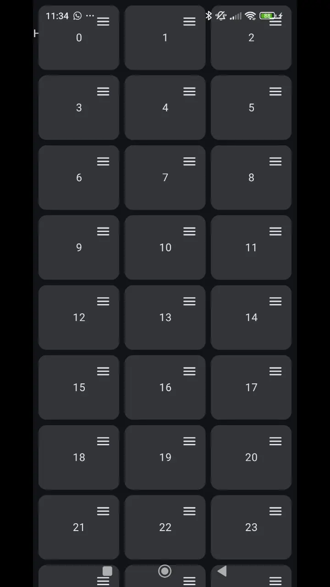

# Reorderable and Stackable

This is a fork of the great job done by Calvin Liang. I use his library in a project but I also need to drag items over other items. I tried to accomplish this without modifiying its library, using wrapped modifiers, but I did not success, so I have edited the library inserting some hooks.


<table width="100%" align="center">
  <tbody>
    <tr>
      <td width="50%">
        
      </td>
    </tr>
  </tbody>
</table>


## Features

- Same cababilities as Calvin-LL/Reorderable
- You can drag and drop items over other items
- Adjustable behaviour through two variables, necessary overlap % to stack an element and ms time to move an element

## Usage

You have a complete example in MainActivity.kt (the one in the gif).
The basic points are: 
 - Create a ReorderableLazyVerticalGrid with:
    - stackingMode
    - overlapThreshold
    - hoverDelayMS
    - onMove
    - onDropOver
 - In some compose element use a Modifier.draggableHande or a Modifier.longPressDraggableHandle


```kotlin
@Composable
fun SimpleReorderableLazyVerticalGridScreen(
    items: List<Item>
) {
    val overlapThreshold = 0.70f // 70% of overlap makes bottom item stand still
    val hoverDelayMs = 500L // 500ms of delay make easy to get any overlap threshold. Fewer ms makes difficult to overlap before below element moves.

    var list by remember { mutableStateOf(items) }
    val lazyGridState = rememberLazyGridState()

    ReorderableLazyVerticalGrid(
        items = list,
        key = { it.id },
        columns = GridCells.Adaptive(minSize = 96.dp),
        modifier = Modifier.fillMaxWidth(),
        state = lazyGridState,
        contentPadding = PaddingValues(8.dp),
        verticalArrangement = Arrangement.spacedBy(8.dp),
        horizontalArrangement = Arrangement.spacedBy(8.dp),
        stackingMode = StackingMode.Enabled, // Cambiar a Disabled para sólo ordenar
        overlapThreshold = overlapThreshold,
        hoverDelayMs = hoverDelayMs,
        onMove = { fromIndex, toIndex ->
            list = list.toMutableList().apply {
                add(toIndex, removeAt(fromIndex))
            }.toList()
        },
        onDropOver = { dragKey, overKey ->
            val dragId = (dragKey as? Int) ?: return@ReorderableLazyVerticalGrid
            val overId = (overKey as? Int) ?: return@ReorderableLazyVerticalGrid
            val draggedItem = list.firstOrNull { it.id == dragId }
            val overItem = list.firstOrNull { it.id == overId }
            if (draggedItem != null && overItem != null) {
                overItem.text += "," + draggedItem.text
                list = list.toMutableList().apply { remove(draggedItem) }.toList()
            }
        }
    ) { item, _ ->
        val interactionSource = remember { MutableInteractionSource() }
        Card(
            onClick = {},
            modifier = Modifier
                .height(96.dp)
                .clearAndSetSemantics { },
            interactionSource = interactionSource,
        ) {
            Box(Modifier.fillMaxSize()) {
                IconButton(
                    modifier = Modifier
                        .align(Alignment.TopEnd)
                        .draggableHandle(
                            interactionSource = interactionSource,
                        )
                        .clearAndSetSemantics { },
                    onClick = {},
                ) {
                    Icon(Icons.Rounded.Menu, contentDescription = "Reorder")
                }
                Text(
                    item.text,
                    Modifier
                        .align(Alignment.Center)
                        .padding(horizontal = 8.dp),
                    textAlign = TextAlign.Center,
                )
            }
        }
    }
}

```
 
If you do not want stackable behaviour simply do not set canDragOver and onDropOver. This way you can have different grids with the same library, one with stackable behaviour and other without it.

